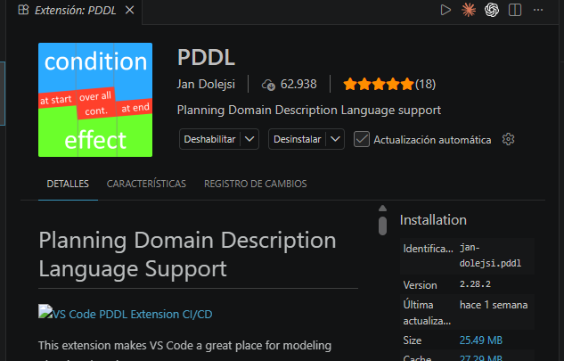
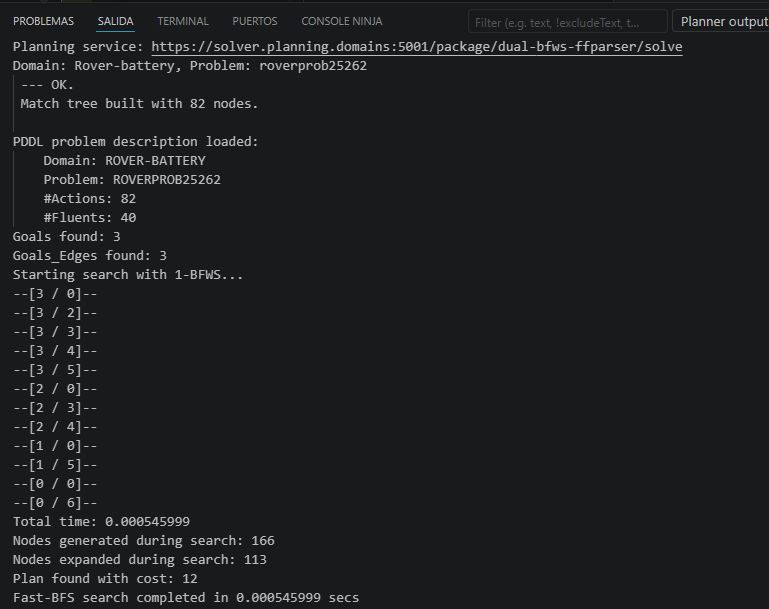

# Actividad 2 (Grupal): Planificación para un rover marciano

Listado de las preguntas del enunciado, para ir marcándolas conforme se resuelven.
Documentación de apoyo: [[Documentacion]] y [[Resumen]].

> [!warning] ⚠️ Reglas que afectan a todas las respuestas
> - Solo **PDDL 1.2**: sin *fluents* numéricos, funciones ni comparaciones (`>`, `<`, `increase`).
> - **Sin tildes ni caracteres internacionales** en los `.pddl`, tampoco en los comentarios: rompen la ejecución remota.
> - Los nombres de fichero deben ser **exactos**; la rúbrica penaliza las partes 2, 3 y 4 si no lo son.
> - Al analizar cualquier ejecución hay que indicar siempre: planificador usado, configuración conocida, búsqueda(s) ejecutada(s), coste del plan, y nodos generados y expandidos. No hay que listar las acciones, pero sí comentar el plan en general.

## Parte 1. Entorno de desarrollo y conceptos básicos

- [X] **1.1.** Demostrar con capturas de pantalla y una breve explicación que se ha instalado o ejecutado en línea un entorno capaz de resolver la actividad.

Se ha usado **Visual Studio Code** con la extensión **PDDL** (`jan-dolejsi.pddl`, v2.28.2), conectada al planificador en línea *Planning as a service* (`https://solver.planning.domains:5001/package`, motor `dual-bfws-ffparser`). Los `.pddl` se editan y validan en local y la resolución se hace en remoto, sin compilar nada en la máquina propia.



Ejecutando el dominio y el problema base, el entorno resuelve el caso: dominio y problema parseados correctamente (82 acciones instanciadas, 40 *fluents*) y **plan encontrado con coste 12**, tras generar 166 nodos y expandir 113 con la búsqueda *Fast-BFS* (1-BFWS). El plan alcanza los tres objetivos: comunica la imagen de alta resolución, la muestra de suelo y la muestra de roca.



- [X] **1.2.** Indicar qué **acciones instanciadas** (acciones + valores de los parámetros) serían potencialmente ejecutables en un primer paso por un planificador de **encadenamiento hacia delante**, partiendo del estado inicial. No basta con listarlas: hay que explicar cómo se ha llegado a la solución.

Vamos acción por acción del dominio, mirando sus precondiciones una a una y quedándonos solo con lo que ya está en el estado inicial.

### navigate-bat

Primero empezamos con esta acción:

```pddl
(:action navigate-bat
:parameters (?r - rover ?y - waypoint ?z - waypoint
             ?b - battery ?bmax ?bcur ?bnext - blevel)
:precondition (and (can_traverse ?r ?y ?z) (available ?r) (at ?r ?y)
                (visible ?y ?z)
                (battery_installed ?r ?b ?bmax ?bcur)
                (lower ?bnext ?bcur))
:effect (and (not (at ?r ?y)) (at ?r ?z)
             (not (battery_installed ?r ?b ?bmax ?bcur))
             (battery_installed ?r ?b ?bmax ?bnext)))
```

1. Empezamos por can_traverse, que en el estado inicial son todas estas:

```pddl
(can_traverse rover0 waypoint3 waypoint0)
(can_traverse rover0 waypoint0 waypoint3)
(can_traverse rover0 waypoint3 waypoint1)
(can_traverse rover0 waypoint1 waypoint3)
(can_traverse rover0 waypoint1 waypoint2)
(can_traverse rover0 waypoint2 waypoint1)
```

2. Luego el available, que se cumple y no descarta nada:

```pddl
(available rover0)
```

3. Luego el at, donde el rover está en waypoint1, así que el movimiento tiene que salir de ahí:

```pddl
(at rover0 waypoint1)
```

De las seis anteriores solo nos quedamos con las que salen de waypoint1, así que los destinos posibles son waypoint2 y waypoint3:

```pddl
(can_traverse rover0 waypoint1 waypoint3)
(can_traverse rover0 waypoint1 waypoint2)
```

4. En el visible tenemos varias en el estado inicial, pero solo tomamos las que salen de waypoint1 y coinciden con los destinos que quedaban. Las dos existen, así que siguen valiendo los dos:

```pddl
(visible waypoint1 waypoint2)
(visible waypoint1 waypoint3)
```

5. Luego vamos por el battery_installed, que solo hay uno, así que la batería es bat0, el máximo b4 y el nivel actual b2:

```pddl
(battery_installed rover0 bat0 b4 b2)
```

6. Y por último el lower. Como el nivel actual ya es b2, de todos los lower del problema solo vale el que termina en b2, y es el único:

```pddl
(lower b1 b2)
```

Estas son entonces las opciones posibles:

```pddl
(navigate-bat rover0 waypoint1 waypoint2 bat0 b4 b2 b1)
(navigate-bat rover0 waypoint1 waypoint3 bat0 b4 b2 b1)
```

### recharge

```pddl
:precondition (and (at ?r ?w) (at_lander ?l ?w)
                (battery_installed ?r ?b ?bmax ?bcur))
```

1. Con el at, igual que antes, el rover está en waypoint1, así que la recarga tendría que ser ahí:

```pddl
(at rover0 waypoint1)
```

2. Luego el at_lander, pero solo hay un lander y está en waypoint2:

```pddl
(at_lander general waypoint2)
```

Como el rover y el lander no están en el mismo sitio, todavía no se puede recargar.

### sample_soil

```pddl
:precondition (and (at ?r ?p) (at_soil_sample ?p) (equipped_for_soil_analysis ?r)
                (store_of ?s ?r) (empty ?s))
```

1. Con el at, el sitio de la muestra tendría que ser waypoint1.
2. Luego el at_soil_sample, pero las muestras de suelo están en los otros waypoints:

```pddl
(at_soil_sample waypoint0)
(at_soil_sample waypoint2)
(at_soil_sample waypoint3)
```

Donde está el rover no hay suelo que tomar, así que no vale.

### sample_rock

```pddl
:precondition (and (at ?r ?p) (at_rock_sample ?p) (equipped_for_rock_analysis ?r)
                (store_of ?s ?r) (empty ?s))
```

1. Con el at, el sitio de la muestra es waypoint1.
2. Luego el at_rock_sample, y aquí sí hay roca en waypoint1:

```pddl
(at_rock_sample waypoint1)
```

3. Luego el equipped_for_rock_analysis, que se cumple:

```pddl
(equipped_for_rock_analysis rover0)
```

4. Luego el store_of, que solo hay un almacén:

```pddl
(store_of rover0store rover0)
```

5. Y el empty, que también se cumple porque el almacén está vacío:

```pddl
(empty rover0store)
```

Se cumplen todas, así que esta opción es posible:

```pddl
(sample_rock rover0 rover0store waypoint1)
```

### drop

```pddl
:precondition (and (store_of ?s ?r) (full ?s))
```

1. Con el store_of el almacén es rover0store.
2. Pero luego pide full, y en el estado inicial el almacén está vacío:

```pddl
(empty rover0store)
```

No se puede vaciar algo que ya está vacío, así que no vale.

### calibrate

```pddl
:precondition (and (equipped_for_imaging ?r) (calibration_target ?i ?t)
                (at ?r ?w) (visible_from ?t ?w) (on_board ?i ?r))
```

1. Empezamos por el equipped_for_imaging, que se cumple:

```pddl
(equipped_for_imaging rover0)
```

2. Luego el calibration_target, que solo hay uno, así que la cámara es camera0 y el objetivo objective1. El objective0 no aparece aquí, por eso no da opciones:

```pddl
(calibration_target camera0 objective1)
```

3. Luego el at, que nos deja en waypoint1.
4. Luego el visible_from, y desde waypoint1 sí se ve el objective1:

```pddl
(visible_from objective1 waypoint1)
```

5. Y el on_board, que también se cumple porque la cámara va montada en el rover:

```pddl
(on_board camera0 rover0)
```

Se cumplen todas, así que esta opción es posible:

```pddl
(calibrate rover0 camera0 objective1 waypoint1)
```

### take_image

```pddl
:precondition (and (calibrated ?i ?r) (on_board ?i ?r) (equipped_for_imaging ?r)
                (supports ?i ?m) (visible_from ?o ?p) (at ?r ?p))
```

1. Empieza pidiendo calibrated, y en el estado inicial no hay ninguno porque eso solo aparece como efecto de calibrate. No se puede fotografiar antes de calibrar, así que ya no hace falta mirar las demás.

### communicate_soil_data, communicate_rock_data y communicate_image_data

```pddl
:precondition (and (at ?r ?x) (at_lander ?l ?y) (have_soil_analysis ?r ?p)
                (visible ?x ?y) (available ?r) (channel_free ?l))
```

Las tres son iguales y fallan por lo mismo: piden have_soil_analysis, have_rock_analysis o have_image, y ninguno está en el estado inicial porque son efectos de sample_soil, sample_rock y take_image. Todavía no hay nada que comunicar.

Entonces, en un primer paso estas cuatro acciones son las posibles:

```pddl
(navigate-bat rover0 waypoint1 waypoint2 bat0 b4 b2 b1)
(navigate-bat rover0 waypoint1 waypoint3 bat0 b4 b2 b1)
(sample_rock  rover0 rover0store waypoint1)
(calibrate    rover0 camera0 objective1 waypoint1)
```

- [X] **1.3.** Lo mismo para un planificador de **encadenamiento hacia atrás**: qué acciones se considerarían en un primer paso a partir del *goal* y con qué valores de parámetros. También con explicación del razonamiento.

### Objetivo 1

El primer objetivo es:

```pddl
(communicated_soil_data waypoint2)
```

Buscamos en los `:effect` de las acciones del dominio cuál puede conseguir este objetivo. En la acción `communicate_soil_data` encontramos:

```pddl
(communicated_soil_data ?p)
```

Entonces sustituimos:

```text
?p = waypoint2
```

La acción queda:

```pddl
(communicate_soil_data ?r ?l waypoint2 ?x ?y)
```

Luego ponemos las variables que solo tienen una opción en el problema. Solo existe un rover, `rover0`, y un lander, `general`:

```text
?r = rover0
?l = general
```

Entonces la acción queda:

```pddl
(communicate_soil_data rover0 general waypoint2 ?x ?y)
```

Después revisamos la precondición:

```pddl
(at_lander general ?y)
```

En el estado inicial tenemos:

```pddl
(at_lander general waypoint2)
```

Por lo tanto:

```text
?y = waypoint2
```

La acción queda:

```pddl
(communicate_soil_data rover0 general waypoint2 ?x waypoint2)
```

Ahora revisamos:

```pddl
(visible ?x waypoint2)
```

Como ninguna acción del dominio tiene en sus efectos el predicado `visible`, este se mantiene igual durante todo el problema. Por eso, sus valores solo se toman del estado inicial, donde ya están definidos:

```pddl
(visible waypoint0 waypoint2)
(visible waypoint1 waypoint2)
(visible waypoint3 waypoint2)
```

Por lo tanto, `?x` puede ser:

```text
?x = waypoint0
?x = waypoint1
?x = waypoint3
```

La precondición:

```pddl
(have_soil_analysis rover0 waypoint2)
```

no está en el estado inicial, pero eso no impide seguir con el encadenamiento hacia atrás, solo significa que se tendrá que conseguir antes.

Por lo tanto, para este primer objetivo tenemos tres posibles acciones:

```pddl
(communicate_soil_data rover0 general waypoint2 waypoint0 waypoint2)

(communicate_soil_data rover0 general waypoint2 waypoint1 waypoint2)

(communicate_soil_data rover0 general waypoint2 waypoint3 waypoint2)
```

### Objetivo 2

El segundo objetivo es:

```pddl
(communicated_rock_data waypoint3)
```

Buscamos en los `:effect` del dominio qué acción puede conseguir este objetivo. En la acción `communicate_rock_data` encontramos:

```pddl
(communicated_rock_data ?p)
```

Como se vio en el objetivo 1, primero fijamos las variables que solo pueden tomar un único valor. El sitio de la muestra viene dado por el objetivo, y del rover y del lander solo hay uno de cada:

```text
?p = waypoint3
?r = rover0
?l = general
```

Entonces la acción queda:

```pddl
(communicate_rock_data rover0 general waypoint3 ?x ?y)
```

Las precondiciones quedan:

```pddl
(at rover0 ?x)
(at_lander general ?y)
(have_rock_analysis rover0 waypoint3)
(visible ?x ?y)
(available rover0)
(channel_free general)
```

Primero revisamos:

```pddl
(at_lander general ?y)
```

En el estado inicial tenemos:

```pddl
(at_lander general waypoint2)
```

Como `at_lander` no cambia en ninguna acción del dominio original, podemos poner:

```text
?y = waypoint2
```

La acción queda:

```pddl
(communicate_rock_data rover0 general waypoint3 ?x waypoint2)
```

Ahora revisamos:

```pddl
(visible ?x waypoint2)
```

Como `visible` tampoco cambia en ninguna acción del dominio, usamos los valores definidos en el estado inicial:

```pddl
(visible waypoint0 waypoint2)
(visible waypoint1 waypoint2)
(visible waypoint3 waypoint2)
```

Por lo tanto, `?x` puede ser:

```text
?x = waypoint0
?x = waypoint1
?x = waypoint3
```

La precondición:

```pddl
(have_rock_analysis rover0 waypoint3)
```

tampoco está en el estado inicial, igual que pasaba con el suelo, pero no impide seguir hacia atrás: solo quiere decir que antes habrá que tomar la muestra de roca.

Por lo tanto, para el segundo objetivo tenemos tres posibles acciones:

```pddl
(communicate_rock_data rover0 general waypoint3 waypoint0 waypoint2)

(communicate_rock_data rover0 general waypoint3 waypoint1 waypoint2)

(communicate_rock_data rover0 general waypoint3 waypoint3 waypoint2)
```

### Objetivo 3

El tercer objetivo es:

```pddl
(communicated_image_data objective1 high_res)
```

Buscamos en los `:effect` del dominio qué acción puede conseguirlo. En la acción `communicate_image_data` encontramos:

```pddl
(communicated_image_data ?o ?m)
```

El objetivo y la cámara nos dan el objetivo a fotografiar y el modo, y como antes solo hay un rover y un lander:

```text
?o = objective1
?m = high_res
?r = rover0
?l = general
```

Entonces la acción queda:

```pddl
(communicate_image_data rover0 general objective1 high_res ?x ?y)
```

Las precondiciones quedan:

```pddl
(at rover0 ?x)
(at_lander general ?y)
(have_image rover0 objective1 high_res)
(visible ?x ?y)
(available rover0)
(channel_free general)
```

Primero revisamos:

```pddl
(at_lander general ?y)
```

Como el lander no se mueve en el dominio original, se queda donde está en el estado inicial:

```text
?y = waypoint2
```

La acción queda:

```pddl
(communicate_image_data rover0 general objective1 high_res ?x waypoint2)
```

Ahora revisamos:

```pddl
(visible ?x waypoint2)
```

Como `visible` tampoco cambia en ninguna acción, usamos los valores del estado inicial:

```pddl
(visible waypoint0 waypoint2)
(visible waypoint1 waypoint2)
(visible waypoint3 waypoint2)
```

Por lo tanto, `?x` puede ser:

```text
?x = waypoint0
?x = waypoint1
?x = waypoint3
```

La precondición:

```pddl
(have_image rover0 objective1 high_res)
```

tampoco está en el estado inicial, así que antes habrá que calibrar la cámara y tomar la foto.

Por lo tanto, para el tercer objetivo tenemos tres posibles acciones:

```pddl
(communicate_image_data rover0 general objective1 high_res waypoint0 waypoint2)

(communicate_image_data rover0 general objective1 high_res waypoint1 waypoint2)

(communicate_image_data rover0 general objective1 high_res waypoint3 waypoint2)
```

- [ ] **1.4.** Ejecutar un planificador adecuado y analizar el plan obtenido **y la traza de ejecución**. Hay que **referenciar y citar el artículo científico** que describe ese planificador para explicar los elementos de la traza.

## Parte 2. Modificación del estado inicial y objetivos

Solo se toca el **fichero de problema**. Las dos cuestiones se resuelven de forma **independiente**, cada una partiendo del problema inicial.

- [ ] **2.1.** Añadir un waypoint nuevo conectado con dos de los anteriores (de forma que el rover pueda moverse a él), que contenga muestra de suelo y de roca. Añadir los objetivos para que se comunique la información de ambas muestras y, además, que el rover **termine en `waypoint1`**. Comentar los cambios en el código y en la memoria.
  → Entregar `rovers_parte2.1_problema.pddl`
- [ ] **2.2.** Añadir un segundo rover (`rover1`) con capacidad de **movimiento y fotografía**, **sin modificar nada de `rover0`**. Debe tener su propia batería con nivel inicial `b2`. Añadir lo necesario para que se comuniquen los datos de **todas** las muestras de roca y suelo del problema y las fotografías de **todos** los objetivos en **los tres modos**. Comentar los cambios.
  → Entregar `rovers_parte2.2_problema.pddl`

## Parte 3. Ejecución y evaluación del planificador

- [ ] **3.1.** Analizar plan y ejecución del caso **2.1** y comparar con el caso inicial. ¿El rover realiza algún **movimiento innecesario**? ¿Por qué cree que ocurre?
- [ ] **3.2.** Analizar plan y ejecución del caso **2.2** y comparar con el plan original. ¿El plan **usa el `rover1`**? ¿Lo hace de la mejor forma posible? ¿A qué se debe ese efecto?

## Parte 4. Modificación del dominio

Escenario: el *lander* solo es utilizable en waypoints adecuados y puede ser remolcado por **dos rovers** actuando conjuntamente. Todos los cambios deben ser **genéricos** (independientes del número y nombre de rovers y landers), lo que puede obligar a ajustar otros operadores y predicados. Requiere definir **más de un rover**.

Cambios pedidos:

1. Representar que **solo algunos waypoints** son físicamente adecuados para usar el lander.
2. Representar que el lander **no puede usarse** si no está en un lugar adecuado, modificando los operadores si hace falta.
3. Añadir un **operador de remolque**: dos rovers distintos mueven el lander de un waypoint a otro, con restricciones similares al movimiento normal, **consumiendo batería de ambos**, y con los tres vehículos empezando y terminando en el mismo punto.

- [ ] **4.1.** Describir en la memoria cómo se ha resuelto: significado de los elementos introducidos, funcionamiento de las nuevas acciones, etc.
- [ ] **4.2.** Crear el nuevo fichero de dominio **con comentarios** en las modificaciones, para que los cambios sean fáciles de localizar.
  → Entregar `rovers_parte4_dominio.pddl`
- [ ] **4.3.** Plantear al menos un **caso de prueba** (estado inicial y objetivos) donde el efecto de la modificación se note, es decir, que se usen los nuevos elementos.
  → Entregar `rovers_parte4_problema.pddl`
- [ ] **4.4.** Ejecutar el planificador y analizar el resultado, repitiendo la discusión de la parte 3 con el nuevo dominio y problema. Se pueden añadir pruebas para comparar solución y coste **permitiendo o no** el nuevo operador.

## Entregables

### Código (nombres exactos)

- [ ] `rovers_parte2.1_problema.pddl`
- [ ] `rovers_parte2.2_problema.pddl`
- [ ] `rovers_parte4_dominio.pddl`
- [ ] `rovers_parte4_problema.pddl`

Se probará automáticamente con **BFWS-dual-ff-parser** y/o **lama-first**. Si un fichero no valida (tildes, PDDL no soportado), se evalúa negativamente.

### Memoria (PDF independiente)

- [ ] Documentación de las secciones 1, 2, 3 y 4.
- [ ] Dificultades encontradas (sobre todo de instalación o ejecución del entorno).
- [ ] Apéndice con **al menos una captura** de la salida del planificador como evidencia.
- [ ] Referencias en **normas APA**.
- [ ] **Declaración de uso de IA**: párrafo indicando qué se hizo con IA y de qué forma.
- [ ] Extensión máxima según rúbrica (`Actividad2_Rovers/entrega/Rubrica_MIA_RYPA_act2.xlsx`).

## Estado actual del repositorio

Lo que ya hay en `Actividad2_Rovers/src/` es el **dominio y problema base** sin modificar, y en [[Documentacion]] está la ejecución del caso inicial (Fast-BFS, coste 12, 113 nodos expandidos), que sirve de base para **1.1** y como punto de comparación para **3.1** y **3.2**. Falta la cita del artículo del planificador que exige **1.4**.
