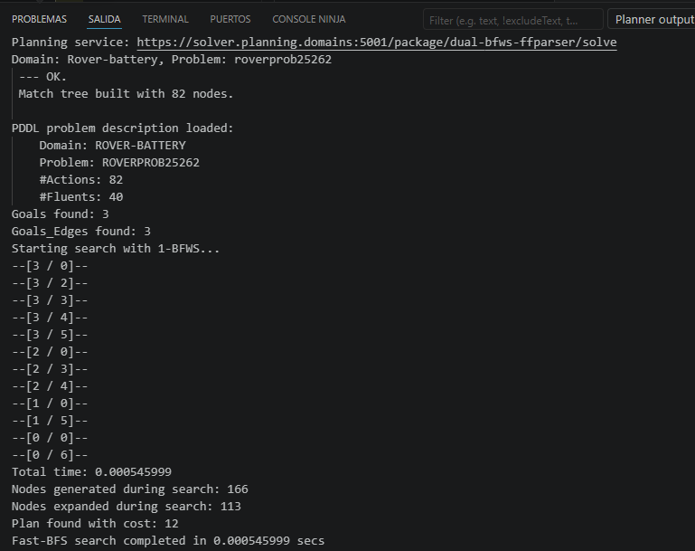

# Actividad 2 (Grupal): Planificación para un rover marciano

Listado de las preguntas del enunciado, para ir marcándolas conforme se resuelven.
Documentación de apoyo: [[Documentacion]] y [[Resumen]].

> [!warning] ⚠️ Reglas que afectan a todas las respuestas
> - Solo **PDDL 1.2**: sin *fluents* numéricos, funciones ni comparaciones (`>`, `<`, `increase`).
> - **Sin tildes ni caracteres internacionales** en los `.pddl`, tampoco en los comentarios: rompen la ejecución remota.
> - Los nombres de fichero deben ser **exactos**; la rúbrica penaliza las partes 2, 3 y 4 si no lo son.
> - Al analizar cualquier ejecución hay que indicar siempre: planificador usado, configuración conocida, búsqueda(s) ejecutada(s), coste del plan, y nodos generados y expandidos. No hay que listar las acciones, pero sí comentar el plan en general.

## Parte 1. Entorno de desarrollo y conceptos básicos

- [X] **1.1.** Demostrar con capturas de pantalla y una breve explicación que se ha instalado o ejecutado en línea un entorno capaz de resolver la actividad.

Se ha usado **Visual Studio Code** con la extensión **PDDL** (`jan-dolejsi.pddl`, v2.28.2), conectada al planificador en línea *Planning as a service* (`https://solver.planning.domains:5001/package`, motor `dual-bfws-ffparser`). Los `.pddl` se editan y validan en local y la resolución se hace en remoto, sin compilar nada en la máquina propia.


Ejecutando el dominio y el problema base, el entorno resuelve el caso: dominio y problema parseados correctamente (82 acciones instanciadas, 40 *fluents*) y **plan encontrado con coste 12**, tras generar 166 nodos y expandir 113 con la búsqueda *Fast-BFS* (1-BFWS). El plan alcanza los tres objetivos: comunica la imagen de alta resolución, la muestra de suelo y la muestra de roca.



- [X] **1.2.** Indicar qué **acciones instanciadas** (acciones + valores de los parámetros) serían potencialmente ejecutables en un primer paso por un planificador de **encadenamiento hacia delante**, partiendo del estado inicial. No basta con listarlas: hay que explicar cómo se ha llegado a la solución.

Vamos acción por acción del dominio, mirando sus precondiciones una a una y quedándonos solo con lo que ya está en el estado inicial.

### navigate-bat

Primero empezamos con esta acción:

```pddl
(:action navigate-bat
:parameters (?r - rover ?y - waypoint ?z - waypoint
             ?b - battery ?bmax ?bcur ?bnext - blevel)
:precondition (and (can_traverse ?r ?y ?z) (available ?r) (at ?r ?y)
                (visible ?y ?z)
                (battery_installed ?r ?b ?bmax ?bcur)
                (lower ?bnext ?bcur))
:effect (and (not (at ?r ?y)) (at ?r ?z)
             (not (battery_installed ?r ?b ?bmax ?bcur))
             (battery_installed ?r ?b ?bmax ?bnext)))
```

1. Empezamos por can_traverse, que en el estado inicial son todas estas:

```pddl
(can_traverse rover0 waypoint3 waypoint0)
(can_traverse rover0 waypoint0 waypoint3)
(can_traverse rover0 waypoint3 waypoint1)
(can_traverse rover0 waypoint1 waypoint3)
(can_traverse rover0 waypoint1 waypoint2)
(can_traverse rover0 waypoint2 waypoint1)
```

2. Luego el available, que se cumple y no descarta nada:

```pddl
(available rover0)
```

3. Luego el at, donde el rover está en waypoint1, así que el movimiento tiene que salir de ahí:

```pddl
(at rover0 waypoint1)
```

De las seis anteriores solo nos quedamos con las que salen de waypoint1, así que los destinos posibles son waypoint2 y waypoint3:

```pddl
(can_traverse rover0 waypoint1 waypoint3)
(can_traverse rover0 waypoint1 waypoint2)
```

4. En el visible tenemos varias en el estado inicial, pero solo tomamos las que salen de waypoint1 y coinciden con los destinos que quedaban. Las dos existen, así que siguen valiendo los dos:

```pddl
(visible waypoint1 waypoint2)
(visible waypoint1 waypoint3)
```

5. Luego vamos por el battery_installed, que solo hay uno, así que la batería es bat0, el máximo b4 y el nivel actual b2:

```pddl
(battery_installed rover0 bat0 b4 b2)
```

6. Y por último el lower. Como el nivel actual ya es b2, de todos los lower del problema solo vale el que termina en b2, y es el único:

```pddl
(lower b1 b2)
```

Estas son entonces las opciones posibles:

```pddl
(navigate-bat rover0 waypoint1 waypoint2 bat0 b4 b2 b1)
(navigate-bat rover0 waypoint1 waypoint3 bat0 b4 b2 b1)
```

### recharge

```pddl
:precondition (and (at ?r ?w) (at_lander ?l ?w)
                (battery_installed ?r ?b ?bmax ?bcur))
```

1. Con el at, igual que antes, el rover está en waypoint1, así que la recarga tendría que ser ahí:

```pddl
(at rover0 waypoint1)
```

2. Luego el at_lander, pero solo hay un lander y está en waypoint2:

```pddl
(at_lander general waypoint2)
```

Como el rover y el lander no están en el mismo sitio, todavía no se puede recargar.

### sample_soil

```pddl
:precondition (and (at ?r ?p) (at_soil_sample ?p) (equipped_for_soil_analysis ?r)
                (store_of ?s ?r) (empty ?s))
```

1. Con el at, el sitio de la muestra tendría que ser waypoint1.
2. Luego el at_soil_sample, pero las muestras de suelo están en los otros waypoints:

```pddl
(at_soil_sample waypoint0)
(at_soil_sample waypoint2)
(at_soil_sample waypoint3)
```

Donde está el rover no hay suelo que tomar, así que no vale.

### sample_rock

```pddl
:precondition (and (at ?r ?p) (at_rock_sample ?p) (equipped_for_rock_analysis ?r)
                (store_of ?s ?r) (empty ?s))
```

1. Con el at, el sitio de la muestra es waypoint1.
2. Luego el at_rock_sample, y aquí sí hay roca en waypoint1:

```pddl
(at_rock_sample waypoint1)
```

3. Luego el equipped_for_rock_analysis, que se cumple:

```pddl
(equipped_for_rock_analysis rover0)
```

4. Luego el store_of, que solo hay un almacén:

```pddl
(store_of rover0store rover0)
```

5. Y el empty, que también se cumple porque el almacén está vacío:

```pddl
(empty rover0store)
```

Se cumplen todas, así que esta opción es posible:

```pddl
(sample_rock rover0 rover0store waypoint1)
```

### drop

```pddl
:precondition (and (store_of ?s ?r) (full ?s))
```

1. Con el store_of el almacén es rover0store.
2. Pero luego pide full, y en el estado inicial el almacén está vacío:

```pddl
(empty rover0store)
```

No se puede vaciar algo que ya está vacío, así que no vale.

### calibrate

```pddl
:precondition (and (equipped_for_imaging ?r) (calibration_target ?i ?t)
                (at ?r ?w) (visible_from ?t ?w) (on_board ?i ?r))
```

1. Empezamos por el equipped_for_imaging, que se cumple:

```pddl
(equipped_for_imaging rover0)
```

2. Luego el calibration_target, que solo hay uno, así que la cámara es camera0 y el objetivo objective1. El objective0 no aparece aquí, por eso no da opciones:

```pddl
(calibration_target camera0 objective1)
```

3. Luego el at, que nos deja en waypoint1.
4. Luego el visible_from, y desde waypoint1 sí se ve el objective1:

```pddl
(visible_from objective1 waypoint1)
```

5. Y el on_board, que también se cumple porque la cámara va montada en el rover:

```pddl
(on_board camera0 rover0)
```

Se cumplen todas, así que esta opción es posible:

```pddl
(calibrate rover0 camera0 objective1 waypoint1)
```

### take_image

```pddl
:precondition (and (calibrated ?i ?r) (on_board ?i ?r) (equipped_for_imaging ?r)
                (supports ?i ?m) (visible_from ?o ?p) (at ?r ?p))
```

1. Empieza pidiendo calibrated, y en el estado inicial no hay ninguno porque eso solo aparece como efecto de calibrate. No se puede fotografiar antes de calibrar, así que ya no hace falta mirar las demás.

### communicate_soil_data, communicate_rock_data y communicate_image_data

```pddl
:precondition (and (at ?r ?x) (at_lander ?l ?y) (have_soil_analysis ?r ?p)
                (visible ?x ?y) (available ?r) (channel_free ?l))
```

Las tres son iguales y fallan por lo mismo: piden have_soil_analysis, have_rock_analysis o have_image, y ninguno está en el estado inicial porque son efectos de sample_soil, sample_rock y take_image. Todavía no hay nada que comunicar.

Entonces, en un primer paso estas cuatro acciones son las posibles:

```pddl
(navigate-bat rover0 waypoint1 waypoint2 bat0 b4 b2 b1)
(navigate-bat rover0 waypoint1 waypoint3 bat0 b4 b2 b1)
(sample_rock  rover0 rover0store waypoint1)
(calibrate    rover0 camera0 objective1 waypoint1)
```

- [X] **1.3.** Lo mismo para un planificador de **encadenamiento hacia atrás**: qué acciones se considerarían en un primer paso a partir del *goal* y con qué valores de parámetros. También con explicación del razonamiento.

### Objetivo 1

El primer objetivo es:

```pddl
(communicated_soil_data waypoint2)
```

Buscamos en los `:effect` de las acciones del dominio cuál puede conseguir este objetivo. En la acción `communicate_soil_data` encontramos:

```pddl
(communicated_soil_data ?p)
```

Entonces sustituimos:

```text
?p = waypoint2
```

La acción queda:

```pddl
(communicate_soil_data ?r ?l waypoint2 ?x ?y)
```

Luego ponemos las variables que solo tienen una opción en el problema. Solo existe un rover, `rover0`, y un lander, `general`:

```text
?r = rover0
?l = general
```

Entonces la acción queda:

```pddl
(communicate_soil_data rover0 general waypoint2 ?x ?y)
```

Después revisamos la precondición:

```pddl
(at_lander general ?y)
```

En el estado inicial tenemos:

```pddl
(at_lander general waypoint2)
```

Por lo tanto:

```text
?y = waypoint2
```

La acción queda:

```pddl
(communicate_soil_data rover0 general waypoint2 ?x waypoint2)
```

Ahora revisamos:

```pddl
(visible ?x waypoint2)
```

Como ninguna acción del dominio tiene en sus efectos el predicado `visible`, este se mantiene igual durante todo el problema. Por eso, sus valores solo se toman del estado inicial, donde ya están definidos:

```pddl
(visible waypoint0 waypoint2)
(visible waypoint1 waypoint2)
(visible waypoint3 waypoint2)
```

Por lo tanto, `?x` puede ser:

```text
?x = waypoint0
?x = waypoint1
?x = waypoint3
```

La precondición:

```pddl
(have_soil_analysis rover0 waypoint2)
```

no está en el estado inicial, pero eso no impide seguir con el encadenamiento hacia atrás, solo significa que se tendrá que conseguir antes.

Por lo tanto, para este primer objetivo tenemos tres posibles acciones:

```pddl
(communicate_soil_data rover0 general waypoint2 waypoint0 waypoint2)

(communicate_soil_data rover0 general waypoint2 waypoint1 waypoint2)

(communicate_soil_data rover0 general waypoint2 waypoint3 waypoint2)
```

### Objetivo 2

El segundo objetivo es:

```pddl
(communicated_rock_data waypoint3)
```

Buscamos en los `:effect` del dominio qué acción puede conseguir este objetivo. En la acción `communicate_rock_data` encontramos:

```pddl
(communicated_rock_data ?p)
```

Como se vio en el objetivo 1, primero fijamos las variables que solo pueden tomar un único valor. El sitio de la muestra viene dado por el objetivo, y del rover y del lander solo hay uno de cada:

```text
?p = waypoint3
?r = rover0
?l = general
```

Entonces la acción queda:

```pddl
(communicate_rock_data rover0 general waypoint3 ?x ?y)
```

Las precondiciones quedan:

```pddl
(at rover0 ?x)
(at_lander general ?y)
(have_rock_analysis rover0 waypoint3)
(visible ?x ?y)
(available rover0)
(channel_free general)
```

Primero revisamos:

```pddl
(at_lander general ?y)
```

En el estado inicial tenemos:

```pddl
(at_lander general waypoint2)
```

Como `at_lander` no cambia en ninguna acción del dominio original, podemos poner:

```text
?y = waypoint2
```

La acción queda:

```pddl
(communicate_rock_data rover0 general waypoint3 ?x waypoint2)
```

Ahora revisamos:

```pddl
(visible ?x waypoint2)
```

Como `visible` tampoco cambia en ninguna acción del dominio, usamos los valores definidos en el estado inicial:

```pddl
(visible waypoint0 waypoint2)
(visible waypoint1 waypoint2)
(visible waypoint3 waypoint2)
```

Por lo tanto, `?x` puede ser:

```text
?x = waypoint0
?x = waypoint1
?x = waypoint3
```

La precondición:

```pddl
(have_rock_analysis rover0 waypoint3)
```

tampoco está en el estado inicial, igual que pasaba con el suelo, pero no impide seguir hacia atrás: solo quiere decir que antes habrá que tomar la muestra de roca.

Por lo tanto, para el segundo objetivo tenemos tres posibles acciones:

```pddl
(communicate_rock_data rover0 general waypoint3 waypoint0 waypoint2)

(communicate_rock_data rover0 general waypoint3 waypoint1 waypoint2)

(communicate_rock_data rover0 general waypoint3 waypoint3 waypoint2)
```

### Objetivo 3

El tercer objetivo es:

```pddl
(communicated_image_data objective1 high_res)
```

Buscamos en los `:effect` del dominio qué acción puede conseguirlo. En la acción `communicate_image_data` encontramos:

```pddl
(communicated_image_data ?o ?m)
```

El objetivo y la cámara nos dan el objetivo a fotografiar y el modo, y como antes solo hay un rover y un lander:

```text
?o = objective1
?m = high_res
?r = rover0
?l = general
```

Entonces la acción queda:

```pddl
(communicate_image_data rover0 general objective1 high_res ?x ?y)
```

Las precondiciones quedan:

```pddl
(at rover0 ?x)
(at_lander general ?y)
(have_image rover0 objective1 high_res)
(visible ?x ?y)
(available rover0)
(channel_free general)
```

Primero revisamos:

```pddl
(at_lander general ?y)
```

Como el lander no se mueve en el dominio original, se queda donde está en el estado inicial:

```text
?y = waypoint2
```

La acción queda:

```pddl
(communicate_image_data rover0 general objective1 high_res ?x waypoint2)
```

Ahora revisamos:

```pddl
(visible ?x waypoint2)
```

Como `visible` tampoco cambia en ninguna acción, usamos los valores del estado inicial:

```pddl
(visible waypoint0 waypoint2)
(visible waypoint1 waypoint2)
(visible waypoint3 waypoint2)
```

Por lo tanto, `?x` puede ser:

```text
?x = waypoint0
?x = waypoint1
?x = waypoint3
```

La precondición:

```pddl
(have_image rover0 objective1 high_res)
```

tampoco está en el estado inicial, así que antes habrá que calibrar la cámara y tomar la foto.

Por lo tanto, para el tercer objetivo tenemos tres posibles acciones:

```pddl
(communicate_image_data rover0 general objective1 high_res waypoint0 waypoint2)

(communicate_image_data rover0 general objective1 high_res waypoint1 waypoint2)

(communicate_image_data rover0 general objective1 high_res waypoint3 waypoint2)
```

- [ ] **1.4.** Ejecutar un planificador adecuado y analizar el plan obtenido **y la traza de ejecución**. Hay que **referenciar y citar el artículo científico** que describe ese planificador para explicar los elementos de la traza.

Para realizar la actividad se utilizó BFWS-dual-FF-parser, ya que es uno de los planificadores de referencia de la actividad, es compatible con PDDL 1.2 y permite encontrar rápidamente un plan válido. Este planificador es satisfactorio, es decir, busca encontrar una solución, pero no garantiza que el plan encontrado sea el más corto.

BFWS utiliza la novedad de los estados y también analiza qué tan cerca se encuentra cada estado de cumplir los objetivos. En la traza aparecen valores como **[3/2]**. El primer número #g representa la cantidad de objetivos que todavía faltan por cumplir, mientras que el segundo #r representa los hechos útiles del último plan relajado que ya se han conseguido. Por eso, el primer valor va disminuyendo de 3 a 0 a medida que se van cumpliendo los objetivos, como explican Lipovetzky y Geffner en 2017.

La configuración Dual-BFWS realiza dos búsquedas. Primero ejecuta 1-BFWS, que es una búsqueda más rápida y trabaja con estados de novedad 1. Si esta búsqueda no encuentra una solución, se realiza una segunda búsqueda más completa. En este caso no fue necesario realizar la segunda búsqueda, porque 1-BFWS encontró directamente un plan válido.

El resultado obtenido fue un plan de 12 acciones, con un coste de 12, debido a que cada acción tiene un coste unitario. Durante la búsqueda se generaron 166 estados, de los cuales 113 fueron expandidos, y el tiempo de búsqueda fue de 0,000634 segundos. Estos valores corresponden a los datos mostrados en la traza proporcionada por el planificador.

Por otro lado, el valor 0,011 que aparece en la última acción de la traza corresponde a la marca temporal de esa acción y no al coste total del plan. Por lo tanto, el coste del plan sigue siendo 12, mientras que 0,011 corresponde al tiempo asociado a la ejecución mostrada en la traza.

Referencia

Lipovetzky, N., y Geffner, H. 2017. Best-first width search: Exploration and exploitation in classical planning. Proceedings of the AAAI Conference on Artificial Intelligence, 31, 3590–3596. [https://doi.org/10.1609/aaai.v31i1.11027](https://doi.org/10.1609/aaai.v31i1.11027)

## Parte 2. Modificación del estado inicial y objetivos

Solo se toca el **fichero de problema**. Las dos cuestiones se resuelven de forma **independiente**, cada una partiendo del problema inicial.

- [X] **2.1.** Añadir un waypoint nuevo conectado con dos de los anteriores (de forma que el rover pueda moverse a él), que contenga muestra de suelo y de roca. Añadir los objetivos para que se comunique la información de ambas muestras y, además, que el rover **termine en `waypoint1`**. Comentar los cambios en el código y en la memoria.
  → Entregar `rovers_parte2.1_problema.pddl`

Revisamos cómo se encuentra el problema actualmente. Como primer paso agregamos el nuevo objeto, que sería el waypoint4, y añadimos las muestras que debe recolectar allí:

```pddl
(at_soil_sample waypoint4)
(at_rock_sample waypoint4)
```

En el enunciado nos piden que se puedan comunicar las muestras, por lo que tenemos que revisar las precondiciones de `communicate_soil_data` y `communicate_rock_data`. La primera condición es `(at ?r ?x)`, que no hay que cambiar porque ya existe `(at rover0 waypoint1)` y la modifica `navigate-bat`. Sigue `(at_lander ?l ?y)`, donde `?y` debe ser waypoint2 según el `:init`, que indica `(at_lander general waypoint2)`. Conectar el waypoint nuevo con waypoint2 permite además al planificador recargar la batería si le hace falta, ya que es la posición del lander. Después vienen `have_soil_analysis` y `have_rock_analysis`, que se generan al tomar las muestras. A continuación viene `(visible ?x ?y)`, y como ya sabemos que `?x` e `?y` son waypoint4 y waypoint2, tenemos que agregar `(visible waypoint4 waypoint2)`. Por último, `(available ?r)` y `(channel_free ?l)` se mantienen por defecto.

Ahora conectamos el waypoint nuevo con dos de los anteriores. Teniendo en cuenta lo anterior, mantenemos waypoint2 por la parte de visibilidad y agregamos waypoint1, que es donde el rover parte al comenzar y donde debe terminar. La conexión se declara en ambas direcciones:

```pddl
(visible waypoint1 waypoint4)
(visible waypoint4 waypoint1)
(visible waypoint2 waypoint4)
(visible waypoint4 waypoint2)
```

Y, lo más importante, que pueda desplazarse, igualmente en ambas direcciones:

```pddl
(can_traverse rover0 waypoint1 waypoint4)
(can_traverse rover0 waypoint4 waypoint1)
(can_traverse rover0 waypoint2 waypoint4)
(can_traverse rover0 waypoint4 waypoint2)
```

Finalmente se definen los objetivos, que son comunicar ambas muestras y que el rover llegue a waypoint1 al final:

```pddl
(communicated_soil_data waypoint4)
(communicated_rock_data waypoint4)
(at rover0 waypoint1)
```

Los resultados al aplicar el planificador  `dual-bfws-ffparser` vía `solver.planning.domains`

```code-runner-output
Nodes generated during search: 369
Nodes expanded during search: 181
Plan found with cost: 20
Fast-BFS search completed in 0.001483 secs
Plan found:
0.00000: (CALIBRATE ROVER0 CAMERA0 OBJECTIVE1 WAYPOINT1)
0.00100: (TAKE_IMAGE ROVER0 WAYPOINT1 OBJECTIVE1 CAMERA0 HIGH_RES)
0.00200: (COMMUNICATE_IMAGE_DATA ROVER0 GENERAL OBJECTIVE1 HIGH_RES WAYPOINT1 WAYPOINT2)
0.00300: (NAVIGATE-BAT ROVER0 WAYPOINT1 WAYPOINT4 BAT0 B4 B2 B1)
0.00400: (SAMPLE_SOIL ROVER0 ROVER0STORE WAYPOINT4)
0.00500: (COMMUNICATE_SOIL_DATA ROVER0 GENERAL WAYPOINT4 WAYPOINT4 WAYPOINT2)
0.00600: (DROP ROVER0 ROVER0STORE)
0.00700: (SAMPLE_ROCK ROVER0 ROVER0STORE WAYPOINT4)
0.00800: (COMMUNICATE_ROCK_DATA ROVER0 GENERAL WAYPOINT4 WAYPOINT4 WAYPOINT2)
0.00900: (NAVIGATE-BAT ROVER0 WAYPOINT4 WAYPOINT2 BAT0 B4 B1 B0)
0.01000: (DROP ROVER0 ROVER0STORE)
0.01100: (SAMPLE_SOIL ROVER0 ROVER0STORE WAYPOINT2)
0.01200: (RECHARGE ROVER0 GENERAL WAYPOINT2 BAT0 B4 B0)
0.01300: (NAVIGATE-BAT ROVER0 WAYPOINT2 WAYPOINT1 BAT0 B4 B4 B3)
0.01400: (COMMUNICATE_SOIL_DATA ROVER0 GENERAL WAYPOINT2 WAYPOINT1 WAYPOINT2)
0.01500: (DROP ROVER0 ROVER0STORE)
0.01600: (NAVIGATE-BAT ROVER0 WAYPOINT1 WAYPOINT3 BAT0 B4 B3 B2)
0.01700: (SAMPLE_ROCK ROVER0 ROVER0STORE WAYPOINT3)
0.01800: (COMMUNICATE_ROCK_DATA ROVER0 GENERAL WAYPOINT3 WAYPOINT3 WAYPOINT2)
0.01900: (NAVIGATE-BAT ROVER0 WAYPOINT3 WAYPOINT1 BAT0 B4 B2 B1)
```

- [X] **2.2.** Añadir un segundo rover (`rover1`) con capacidad de **movimiento y fotografía**, **sin modificar nada de `rover0`**. Debe tener su propia batería con nivel inicial `b2`. Añadir lo necesario para que se comuniquen los datos de **todas** las muestras de roca y suelo del problema y las fotografías de **todos** los objetivos en **los tres modos**. Comentar los cambios.
  → Entregar `rovers_parte2.2_problema.pddl`

En la primera parte agregamos todos los objetos que son `rover1`, `bat1` y `camera1`. Luego lo ponemos disponible con `(available rover1)` y hacemos que inicie en algún punto, en este caso le puse `(at rover1 waypoint0)` porque desde waypoint0 también son visibles todos los objetivos. Con esto podemos decir que waypoint3 no sería una buena decisión, porque desde ahí el rover no tendría acceso a toda la información de los objetivos desde el principio.

Revisemos ahora la implementación de la cámara. Como primer paso, que `camera1` esté a bordo de `rover1` con `(on_board camera1 rover1)`. También que esté calibrada para todos los objetivos, mediante `(calibration_target camera1 objective0)` y `(calibration_target camera1 objective1)`. Y, como menciona el enunciado, que soporte los tres modos con `(supports camera1 colour)`, `(supports camera1 low_res)` y `(supports camera1 high_res)`.

En cuanto a la batería, hay que instalarla con un nivel inicial `b2` mediante `(battery_installed rover1 bat1 b4 b2)`. Como máximo se elige `b4` en lugar de `b5`, porque la precondición `(lower ?bnext ?bcur)` de la acción `navigate-bat` exige que exista un nivel inferior al actual. Al no haber ningún hecho `lower` con `b5` como segundo argumento, el rover quedaría bloqueado justo después de recargar.

De ahí agregamos las rutas que puede recorrer copiamos las rutas del rover0 y agregamos más rutas con el lander para que no se quede sin batería en el caso que lo necesite.

```pddl
	(can_traverse rover1 waypoint0 waypoint2)
	(can_traverse rover1 waypoint2 waypoint0)
	(can_traverse rover1 waypoint3 waypoint2)
	(can_traverse rover1 waypoint2 waypoint3)
```

Con esto ya podemos pasar a los objetivos. Primero faltan las comunicaciones de los datos de las muestras que sí existen en el escenario:

```pddl
	(communicated_soil_data waypoint0)
	(communicated_soil_data waypoint3)
	(communicated_rock_data waypoint1)
	(communicated_rock_data waypoint2
```

Y de ahí únicamente queda añadir los tres modos para los dos objetivos:

```pddl
	(communicated_image_data objective0 colour)
	(communicated_image_data objective0 high_res)
	(communicated_image_data objective0 low_res)
	(communicated_image_data objective1 colour)
	(communicated_image_data objective1 low_res)
```

Realizamos las pruebas y miramos si algo falta para cumplir el enuciado

Los resultados al aplicar el planificador  `dual-bfws-ffparser` vía `solver.planning.domains`lo cual nos muestran que cumplen cada parte y no hay que agregar más información

```code-runner-output
Total time: 0.003008
Nodes generated during search: 736
Nodes expanded during search: 392
Plan found with cost: 45
Fast-BFS search completed in 0.003008 secs


Plan found:
0.00000: (SAMPLE_ROCK ROVER0 ROVER0STORE WAYPOINT1)
0.00100: (COMMUNICATE_ROCK_DATA ROVER0 GENERAL WAYPOINT1 WAYPOINT1 WAYPOINT2)
0.00200: (CALIBRATE ROVER0 CAMERA0 OBJECTIVE1 WAYPOINT1)
0.00300: (TAKE_IMAGE ROVER0 WAYPOINT1 OBJECTIVE1 CAMERA0 HIGH_RES)
0.00400: (COMMUNICATE_IMAGE_DATA ROVER0 GENERAL OBJECTIVE1 HIGH_RES WAYPOINT1 WAYPOINT2)
0.00500: (CALIBRATE ROVER0 CAMERA0 OBJECTIVE1 WAYPOINT1)
0.00600: (TAKE_IMAGE ROVER0 WAYPOINT1 OBJECTIVE0 CAMERA0 COLOUR)
0.00700: (COMMUNICATE_IMAGE_DATA ROVER0 GENERAL OBJECTIVE0 COLOUR WAYPOINT1 WAYPOINT2)
0.00800: (CALIBRATE ROVER1 CAMERA1 OBJECTIVE0 WAYPOINT0)
0.00900: (TAKE_IMAGE ROVER1 WAYPOINT0 OBJECTIVE1 CAMERA1 COLOUR)
0.01000: (COMMUNICATE_IMAGE_DATA ROVER1 GENERAL OBJECTIVE1 COLOUR WAYPOINT0 WAYPOINT2)
0.01100: (CALIBRATE ROVER1 CAMERA1 OBJECTIVE0 WAYPOINT0)
0.01200: (TAKE_IMAGE ROVER1 WAYPOINT0 OBJECTIVE0 CAMERA1 HIGH_RES)
0.01300: (COMMUNICATE_IMAGE_DATA ROVER1 GENERAL OBJECTIVE0 HIGH_RES WAYPOINT0 WAYPOINT2)
0.01400: (CALIBRATE ROVER1 CAMERA1 OBJECTIVE0 WAYPOINT0)
0.01500: (TAKE_IMAGE ROVER1 WAYPOINT0 OBJECTIVE0 CAMERA1 LOW_RES)
0.01600: (COMMUNICATE_IMAGE_DATA ROVER1 GENERAL OBJECTIVE0 LOW_RES WAYPOINT0 WAYPOINT2)
0.01700: (CALIBRATE ROVER1 CAMERA1 OBJECTIVE0 WAYPOINT0)
0.01800: (TAKE_IMAGE ROVER1 WAYPOINT0 OBJECTIVE1 CAMERA1 LOW_RES)
0.01900: (COMMUNICATE_IMAGE_DATA ROVER1 GENERAL OBJECTIVE1 LOW_RES WAYPOINT0 WAYPOINT2)
0.02000: (NAVIGATE-BAT ROVER0 WAYPOINT1 WAYPOINT2 BAT0 B4 B2 B1)
0.02100: (DROP ROVER0 ROVER0STORE)
0.02200: (RECHARGE ROVER0 GENERAL WAYPOINT2 BAT0 B4 B1)
0.02300: (SAMPLE_ROCK ROVER0 ROVER0STORE WAYPOINT2)
0.02400: (NAVIGATE-BAT ROVER0 WAYPOINT2 WAYPOINT1 BAT0 B4 B4 B3)
0.02500: (COMMUNICATE_ROCK_DATA ROVER0 GENERAL WAYPOINT2 WAYPOINT1 WAYPOINT2)
0.02600: (NAVIGATE-BAT ROVER0 WAYPOINT1 WAYPOINT2 BAT0 B4 B3 B2)
0.02700: (DROP ROVER0 ROVER0STORE)
0.02800: (SAMPLE_SOIL ROVER0 ROVER0STORE WAYPOINT2)
0.02900: (NAVIGATE-BAT ROVER0 WAYPOINT2 WAYPOINT1 BAT0 B4 B2 B1)
0.03000: (COMMUNICATE_SOIL_DATA ROVER0 GENERAL WAYPOINT2 WAYPOINT1 WAYPOINT2)
0.03100: (NAVIGATE-BAT ROVER0 WAYPOINT1 WAYPOINT2 BAT0 B4 B1 B0)
0.03200: (RECHARGE ROVER0 GENERAL WAYPOINT2 BAT0 B4 B0)
0.03300: (DROP ROVER0 ROVER0STORE)
0.03400: (NAVIGATE-BAT ROVER0 WAYPOINT2 WAYPOINT1 BAT0 B4 B4 B3)
0.03500: (NAVIGATE-BAT ROVER0 WAYPOINT1 WAYPOINT3 BAT0 B4 B3 B2)
0.03600: (SAMPLE_ROCK ROVER0 ROVER0STORE WAYPOINT3)
0.03700: (COMMUNICATE_ROCK_DATA ROVER0 GENERAL WAYPOINT3 WAYPOINT3 WAYPOINT2)
0.03800: (DROP ROVER0 ROVER0STORE)
0.03900: (SAMPLE_SOIL ROVER0 ROVER0STORE WAYPOINT3)
0.04000: (COMMUNICATE_SOIL_DATA ROVER0 GENERAL WAYPOINT3 WAYPOINT3 WAYPOINT2)
0.04100: (NAVIGATE-BAT ROVER0 WAYPOINT3 WAYPOINT0 BAT0 B4 B2 B1)
0.04200: (DROP ROVER0 ROVER0STORE)
0.04300: (SAMPLE_SOIL ROVER0 ROVER0STORE WAYPOINT0)
0.04400: (COMMUNICATE_SOIL_DATA ROVER0 GENERAL WAYPOINT0 WAYPOINT0 WAYPOINT2)
Metric: 0.04400000000000003
Makespan: 0.04400000000000003
States evaluated: undefined
Planner found 1 plan(s) in 2.772secs.
```

## Parte 3. Ejecución y evaluación del planificador

- [ ] **3.1.** Analizar plan y ejecución del caso **2.1** y comparar con el caso inicial. ¿El rover realiza algún **movimiento innecesario**? ¿Por qué cree que ocurre?
- [ ] **3.2.** Analizar plan y ejecución del caso **2.2** y comparar con el plan original. ¿El plan **usa el `rover1`**? ¿Lo hace de la mejor forma posible? ¿A qué se debe ese efecto?

## Parte 4. Modificación del dominio

Escenario: el *lander* solo es utilizable en waypoints adecuados y puede ser remolcado por **dos rovers** actuando conjuntamente. Todos los cambios deben ser **genéricos** (independientes del número y nombre de rovers y landers), lo que puede obligar a ajustar otros operadores y predicados. Requiere definir **más de un rover**.

Cambios pedidos:

1. Representar que **solo algunos waypoints** son físicamente adecuados para usar el lander.
2. Representar que el lander **no puede usarse** si no está en un lugar adecuado, modificando los operadores si hace falta.
3. Añadir un **operador de remolque**: dos rovers distintos mueven el lander de un waypoint a otro, con restricciones similares al movimiento normal, **consumiendo batería de ambos**, y con los tres vehículos empezando y terminando en el mismo punto.

- [ ] **4.1.** Describir en la memoria cómo se ha resuelto: significado de los elementos introducidos, funcionamiento de las nuevas acciones, etc.

Primero creamos el predicado `suitable_for_lander ?w`, que indica si un waypoint es adecuado para el lander. Con él ponemos precondiciones a las acciones que usan el lander, que son `recharge`, `communicate_soil_data`, `communicate_rock_data` y `communicate_image_data`. Si el lander no está en un punto adecuado, no se pueden realizar estas acciones. Por eso en el `init` debemos indicar al menos un punto adecuado, ya que sin él no podríamos conseguir el goal, porque las comunicaciones necesitan el lander.

Luego creamos la acción de remolque `tow_lander`. Lo primero que tenemos que ver son los parámetros. Están los dos rovers (`?r1` y `?r2`), el lander (`?l`), el waypoint `?y` donde estoy y el waypoint `?z` adonde quiero ir. También están las baterías de los dos rovers con sus niveles máximo, actual y siguiente.

Después vamos a las precondiciones. El rover 1 no puede ser igual al rover 2, y los dos rovers y el lander deben estar en la misma posición `?y`. Los dos rovers tienen que estar disponibles y poder ir de `?y` a `?z`, y además `?z` tiene que ser visible desde `?y`, igual que en el movimiento normal. Por último, los dos rovers deben tener la batería instalada y un nivel suficiente para poder hacer el viaje, es decir, que exista un nivel por debajo del actual.

El efecto cambia la posición de los rovers y del lander de `?y` a `?z`. Además, únicamente cambia la batería de cada rover a su nuevo valor, que es un nivel menos que el actual, mientras que la carga máxima no cambia.

- [ ] **4.2.** Crear el nuevo fichero de dominio **con comentarios** en las modificaciones, para que los cambios sean fáciles de localizar.
  → Entregar `rovers_parte4_dominio.pddl`
- [ ] **4.3.** Plantear al menos un **caso de prueba** (estado inicial y objetivos) donde el efecto de la modificación se note, es decir, que se usen los nuevos elementos.
  → Entregar `rovers_parte4_problema.pddl`
- [ ] **4.4.** Ejecutar el planificador y analizar el resultado, repitiendo la discusión de la parte 3 con el nuevo dominio y problema. Se pueden añadir pruebas para comparar solución y coste **permitiendo o no** el nuevo operador.


Ejecutamos el planificador BFWS con el nuevo dominio y problema, y encontró un plan de coste 13 en 0.00054 segundos, expandiendo 124 nodos. En el plan, cada rover toma su muestra, luego los dos van a waypoint3 y remolcan el lander hasta waypoint2, que es el único punto adecuado. Después cada rover se mueve para comunicar sus datos y rover0 toma y comunica la imagen.

Al principio el planificador no encontraba plan porque rover0 no tenía camino hasta el lander y su batería no le alcanzaba para llegar y remolcar. Esto muestra que, entre más precondiciones ponemos, más cuidado hay que tener con la batería, los caminos y la visibilidad para que el goal se pueda cumplir.

Para comparar, ejecutamos el mismo problema sin la acción tow_lander y el planificador no encuentra solución, porque el lander se queda en un sitio no adecuado y no se puede comunicar nada. Esto demuestra que el remolque es necesario.

Con los valores iniciales de este problema, el plan de coste 13 es el de menor coste posible. Lo comprobamos con un planificador óptimo, que también dio 13, y además se puede justificar contando las acciones obligatorias. Hacen falta 8 acciones que no son movimientos, que son dos muestras, una calibración, una imagen, tres comunicaciones y un remolque. A eso se suman 5 movimientos. rover1 tiene que ir una vez a waypoint3 y rover0 dos veces para llegar hasta el lander. Después del remolque, los dos rovers tienen que moverse una vez más, porque en el problema no está definido que un waypoint sea visible desde sí mismo, así que no se puede comunicar desde el mismo sitio donde está el lander. En total son 13 acciones y ninguna sobra.

Igual que en la parte 3, revisamos si hay movimientos innecesarios. Los dos desplazamientos después del remolque parecen innecesarios, pero son obligatorios por cómo está definida la visibilidad. Si indicamos que waypoint2 es visible desde sí mismo, los rovers pueden comunicar sin moverse y el coste baja de 13 a 11. BFWS busca encontrar una solución rápido y no garantiza la mejor posible, pero en este caso sí encontró el óptimo. Por eso esos movimientos extra no son culpa del planificador, sino de los valores del problema. En general, los nuevos requisitos hacen que se necesiten más acciones, pero el modelo es más realista.


```code-runner-output
PDDL problem description loaded: 
	Domain: ROVER-BATTERY
	Problem: ROVERPROB-PARTE4
	#Actions: 125
	#Fluents: 36
Goals found: 3
Goals_Edges found: 3
Starting search with 1-BFWS...
--[3 / 0]--
--[3 / 5]--
--[3 / 6]--
--[3 / 7]--
--[3 / 8]--
--[3 / 9]--
--[2 / 0]--
--[2 / 9]--
--[1 / 0]--
--[1 / 5]--
--[0 / 0]--
--[0 / 3]--
Total time: 0.000251
Nodes generated during search: 89
Nodes expanded during search: 39
Plan found with cost: 10
Fast-BFS search completed in 0.000251 secs


Plan found:
0.00000: (TOW_LANDER ROVER1 ROVER0 GENERAL WAYPOINT0 WAYPOINT2 BAT1 B4 B2 B1 BAT0 B4 B2 B1)
0.00100: (NAVIGATE-BAT ROVER1 WAYPOINT2 WAYPOINT3 BAT1 B4 B1 B0)
0.00200: (SAMPLE_ROCK ROVER1 ROVER1STORE WAYPOINT3)
0.00300: (COMMUNICATE_ROCK_DATA ROVER1 GENERAL WAYPOINT3 WAYPOINT3 WAYPOINT2)
0.00400: (NAVIGATE-BAT ROVER0 WAYPOINT2 WAYPOINT1 BAT0 B4 B1 B0)
0.00500: (SAMPLE_SOIL ROVER0 ROVER0STORE WAYPOINT1)
0.00600: (COMMUNICATE_SOIL_DATA ROVER0 GENERAL WAYPOINT1 WAYPOINT1 WAYPOINT2)
0.00700: (CALIBRATE ROVER0 CAMERA0 OBJECTIVE1 WAYPOINT1)
0.00800: (TAKE_IMAGE ROVER0 WAYPOINT1 OBJECTIVE1 CAMERA0 HIGH_RES)
0.00900: (COMMUNICATE_IMAGE_DATA ROVER0 GENERAL OBJECTIVE1 HIGH_RES WAYPOINT1 WAYPOINT2)
Metric: 0.009000000000000001
Makespan: 0.009000000000000001
States evaluated: undefined
Planner found 1 plan(s) in 3.526secs.
```


```code-runner-output
Planning service: https://solver.planning.domains:5001/package/dual-bfws-ffparser/solve
Domain: Rover-battery, Problem: roverprob-parte4
 --- OK.
 Match tree built with 200 nodes.

PDDL problem description loaded: 
	Domain: ROVER-BATTERY
	Problem: ROVERPROB-PARTE4
	#Actions: 200
	#Fluents: 38
Goals found: 3
Goals_Edges found: 3
Starting search with 1-BFWS...
--[3 / 0]--
--[3 / 2]--
--[3 / 3]--
--[3 / 4]--
--[3 / 5]--
--[3 / 6]--
--[3 / 7]--
--[3 / 8]--
--[3 / 9]--
--[3 / 10]--
--[3 / 11]--
--[3 / 12]--
--[3 / 13]--
--[2 / 0]--
--[2 / 12]--
--[1 / 0]--
--[1 / 2]--
--[0 / 0]--
--[0 / 3]--
Total time: 0.000539001
Nodes generated during search: 169
Nodes expanded during search: 124
Plan found with cost: 13
Fast-BFS search completed in 0.000539001 secs


Plan found:
0.00000: (SAMPLE_SOIL ROVER0 ROVER0STORE WAYPOINT1)
0.00100: (NAVIGATE-BAT ROVER0 WAYPOINT1 WAYPOINT2 BAT0 B4 B4 B3)
0.00200: (NAVIGATE-BAT ROVER1 WAYPOINT2 WAYPOINT3 BAT1 B4 B4 B3)
0.00300: (SAMPLE_ROCK ROVER1 ROVER1STORE WAYPOINT3)
0.00400: (NAVIGATE-BAT ROVER0 WAYPOINT2 WAYPOINT3 BAT0 B4 B3 B2)
0.00500: (TOW_LANDER ROVER1 ROVER0 GENERAL WAYPOINT3 WAYPOINT2 BAT1 B4 B3 B2 BAT0 B4 B2 B1)
0.00600: (NAVIGATE-BAT ROVER0 WAYPOINT2 WAYPOINT1 BAT0 B4 B1 B0)
0.00700: (COMMUNICATE_SOIL_DATA ROVER0 GENERAL WAYPOINT1 WAYPOINT1 WAYPOINT2)
0.00800: (NAVIGATE-BAT ROVER1 WAYPOINT2 WAYPOINT3 BAT1 B4 B2 B1)
0.00900: (COMMUNICATE_ROCK_DATA ROVER1 GENERAL WAYPOINT3 WAYPOINT3 WAYPOINT2)
0.01000: (CALIBRATE ROVER0 CAMERA0 OBJECTIVE1 WAYPOINT1)
0.01100: (TAKE_IMAGE ROVER0 WAYPOINT1 OBJECTIVE1 CAMERA0 HIGH_RES)
0.01200: (COMMUNICATE_IMAGE_DATA ROVER0 GENERAL OBJECTIVE1 HIGH_RES WAYPOINT1 WAYPOINT2)
Metric: 0.012000000000000004
Makespan: 0.012000000000000004
States evaluated: undefined
Planner found 1 plan(s) in 3.551secs.
```


```code-runner-output
Planning service: https://solver.planning.domains:5001/package/dual-bfws-ffparser/solve
Domain: Rover-battery, Problem: roverprob-parte4
 --- OK.
 Match tree built with 204 nodes.

PDDL problem description loaded: 
	Domain: ROVER-BATTERY
	Problem: ROVERPROB-PARTE4
	#Actions: 204
	#Fluents: 38
Goals found: 3
Goals_Edges found: 3
Starting search with 1-BFWS...
--[3 / 0]--
--[3 / 2]--
--[3 / 3]--
--[3 / 4]--
--[3 / 5]--
--[3 / 6]--
--[3 / 7]--
--[3 / 8]--
--[3 / 9]--
--[3 / 11]--
--[2 / 0]--
--[2 / 10]--
--[1 / 0]--
--[1 / 3]--
--[1 / 4]--
--[0 / 0]--
--[0 / 5]--
Total time: 0.000595003
Nodes generated during search: 197
Nodes expanded during search: 114
Plan found with cost: 12
Fast-BFS search completed in 0.000595003 secs


Plan found:
0.00000: (NAVIGATE-BAT ROVER0 WAYPOINT1 WAYPOINT2 BAT0 B4 B4 B3)
0.00100: (NAVIGATE-BAT ROVER0 WAYPOINT2 WAYPOINT3 BAT0 B4 B3 B2)
0.00200: (NAVIGATE-BAT ROVER1 WAYPOINT2 WAYPOINT3 BAT1 B4 B4 B3)
0.00300: (SAMPLE_ROCK ROVER1 ROVER1STORE WAYPOINT3)
0.00400: (TOW_LANDER ROVER1 ROVER0 GENERAL WAYPOINT3 WAYPOINT2 BAT1 B4 B3 B2 BAT0 B4 B2 B1)
0.00500: (COMMUNICATE_ROCK_DATA ROVER1 GENERAL WAYPOINT3 WAYPOINT2 WAYPOINT2)
0.00600: (CALIBRATE ROVER0 CAMERA0 OBJECTIVE1 WAYPOINT2)
0.00700: (TAKE_IMAGE ROVER0 WAYPOINT2 OBJECTIVE1 CAMERA0 HIGH_RES)
0.00800: (COMMUNICATE_IMAGE_DATA ROVER0 GENERAL OBJECTIVE1 HIGH_RES WAYPOINT2 WAYPOINT2)
0.00900: (NAVIGATE-BAT ROVER0 WAYPOINT2 WAYPOINT1 BAT0 B4 B1 B0)
0.01000: (SAMPLE_SOIL ROVER0 ROVER0STORE WAYPOINT1)
0.01100: (COMMUNICATE_SOIL_DATA ROVER0 GENERAL WAYPOINT1 WAYPOINT1 WAYPOINT2)
Metric: 0.011000000000000003
Makespan: 0.011000000000000003
States evaluated: undefined
Planner found 1 plan(s) in 3.53secs.
```

## Entregables

### Código (nombres exactos)

- [X] `rovers_parte2.1_problema.pddl`
- [X] `rovers_parte2.2_problema.pddl`
- [X] `rovers_parte4_dominio.pddl`
- [X] `rovers_parte4_problema.pddl`

Se probará automáticamente con **BFWS-dual-ff-parser** y/o **lama-first**. Si un fichero no valida (tildes, PDDL no soportado), se evalúa negativamente.

### Memoria (PDF independiente)

- [ ] Documentación de las secciones 1, 2, 3 y 4.
- [ ] Dificultades encontradas (sobre todo de instalación o ejecución del entorno).
- [ ] Apéndice con **al menos una captura** de la salida del planificador como evidencia.
- [ ] Referencias en **normas APA**.
- [ ] **Declaración de uso de IA**: párrafo indicando qué se hizo con IA y de qué forma.
- [ ] Extensión máxima según rúbrica (`Actividad2_Rovers/entrega/Rubrica_MIA_RYPA_act2.xlsx`).

## Estado actual del repositorio

Lo que ya hay en `Actividad2_Rovers/src/` es el **dominio y problema base** sin modificar, y en [[Documentacion]] está la ejecución del caso inicial (Fast-BFS, coste 12, 113 nodos expandidos), que sirve de base para **1.1** y como punto de comparación para **3.1** y **3.2**. Falta la cita del artículo del planificador que exige **1.4**.

```code-runner-output
Plan found:
0.00000: (CALIBRATE ROVER0 CAMERA0 OBJECTIVE1 WAYPOINT1)
0.00100: (TAKE_IMAGE ROVER0 WAYPOINT1 OBJECTIVE1 CAMERA0 HIGH_RES)
0.00200: (COMMUNICATE_IMAGE_DATA ROVER0 GENERAL OBJECTIVE1 HIGH_RES WAYPOINT1 WAYPOINT2)
0.00300: (NAVIGATE-BAT ROVER0 WAYPOINT1 WAYPOINT4 BAT0 B4 B2 B1)
0.00400: (SAMPLE_SOIL ROVER0 ROVER0STORE WAYPOINT4)
0.00500: (COMMUNICATE_SOIL_DATA ROVER0 GENERAL WAYPOINT4 WAYPOINT4 WAYPOINT2)
0.00600: (DROP ROVER0 ROVER0STORE)
0.00700: (SAMPLE_ROCK ROVER0 ROVER0STORE WAYPOINT4)
0.00800: (COMMUNICATE_ROCK_DATA ROVER0 GENERAL WAYPOINT4 WAYPOINT4 WAYPOINT2)
0.00900: (NAVIGATE-BAT ROVER0 WAYPOINT4 WAYPOINT2 BAT0 B4 B1 B0)
0.01000: (DROP ROVER0 ROVER0STORE)
0.01100: (SAMPLE_SOIL ROVER0 ROVER0STORE WAYPOINT2)
0.01200: (RECHARGE ROVER0 GENERAL WAYPOINT2 BAT0 B4 B0)
0.01300: (NAVIGATE-BAT ROVER0 WAYPOINT2 WAYPOINT1 BAT0 B4 B4 B3)
0.01400: (COMMUNICATE_SOIL_DATA ROVER0 GENERAL WAYPOINT2 WAYPOINT1 WAYPOINT2)
0.01500: (DROP ROVER0 ROVER0STORE)
0.01600: (NAVIGATE-BAT ROVER0 WAYPOINT1 WAYPOINT3 BAT0 B4 B3 B2)
0.01700: (SAMPLE_ROCK ROVER0 ROVER0STORE WAYPOINT3)
0.01800: (COMMUNICATE_ROCK_DATA ROVER0 GENERAL WAYPOINT3 WAYPOINT3 WAYPOINT2)
0.01900: (NAVIGATE-BAT ROVER0 WAYPOINT3 WAYPOINT1 BAT0 B4 B2 B1)
```
